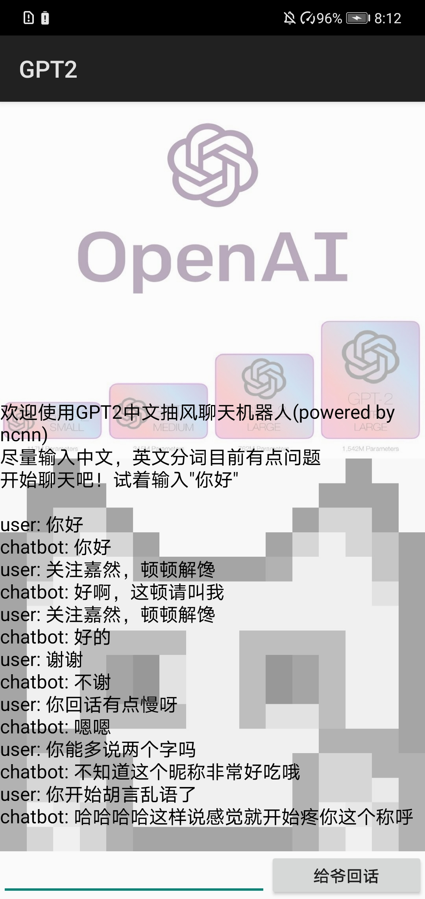

# GPT2-ChineseChat-NCNN

**What**：GPT有很多优秀的模型，选模型让我头疼了好久，大家对于部署来说是更倾向于用[minGPT](https://github.com/karpathy/minGPT)这个模型的，但我没卡训一个中文的模型出来。所以只好选现成的中文模型，考虑到对话形式较好展示就选了[GPT2-chitchat](https://github.com/yangjianxin1/GPT2-chitchat)这个项目了。(PS:经过测试这个模型对话质量并不高，只能图一乐，主要还是展示把GPT放到ncnn的工作)

**工作目标**：使用[ncnn](https://github.com/Tencent/ncnn)部署[GPT2-chitchat](https://github.com/yangjianxin1/GPT2-chitchat)这个基于GPT2的中文对话模型，目标是给出x86和android端的demo

### 展示
android：[APK下载(6666)](https://pan.baidu.com/s/1zN1fDREJd-MR2B8BpzO55Q)

x86：(目前看起来，看着有点正常，但又有点胡言乱语的感觉)

### 工作内容
- [x] pytorch模型梳理与导出
- [x] x86 demo (PS:由于模型太大，我拆成了四个传到github的，所以要把assert下的四个bin*给cat成一个)
- [x] android demo (编译的话，把x86的assert下的bin模型复制到android的assert下，一样的)

### 目前问题
1. ~~x86的工程只依赖ncnn，但是我在ncnn源码里修改了一步分来适配模型的计算，考虑在做安卓版本的时候，统一改成原生ncnn就能用的模型~~
2. 目前的tokenizer实现的比较随便，常见中文应该是没问题的，英文的话分词分不出来的，会一个字母一个字母的转译

### 参考
1. [ncnn](https://github.com/Tencent/ncnn)
2. [GPT2-chitchat](https://github.com/yangjianxin1/GPT2-chitchat)